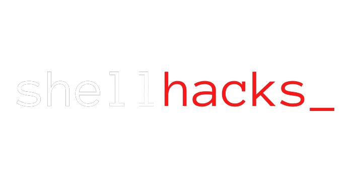
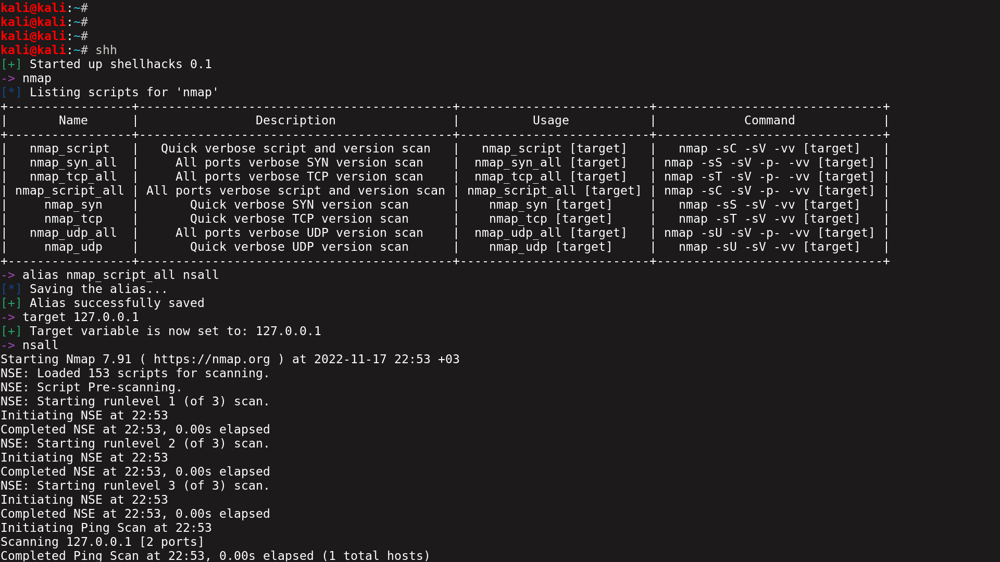

<p align="center">
  
</p>

Shellhacks is a tool written in python, it lets you
run shell scripts to make it more easier to work
with different tools in cyber security.

# State of the project
Shellhacks is currently in development and some
of the scripts only work on Kali Linux since
they look for pre-installed wordlists.

Also new tools will we be added.

<p align="center">
  
</p>

# Installation
1. Clone the repo
```
git clone https://github.com/ngn13/shellhacks.git
```
2. cd into repo and install the requirements
```
cd shellhacks && pip install -r requirements.txt
```
3. Run shellhacks
```
python shellhacks.py
```

### Optional: Adding alias to .rc
If you want to access shellhacks anytime you want throught the shell, then
I suggest you add an alias for it to your `.rc` file, you can find
your `.rc` file in your home folder, if you are using ZSH its named `.zshrc`,
if you are using BASH then its named `.bashrc`. Add the following line into
it:
```
alias shh="cd /path/to/shellhacks/ && python shellhacks.py"
```

# Usage
- In order to list scripts for a tool just type its name.
- In order to use a script type its name.
- Use `alias` command to give different aliases to script that you use most
- Use `aliases` command to list aliases
- Use `target` command to set the `target` variable
- Use `url` command to set the `url` variable
- Use `hash` command to set the `hash` variable
- Lastly use `file` command to set the `file` variable
Happy hacking!

# Contributing
Any help would be appreciated, send a pull request if you wanna contribute.

# License
This project is under MIT license, check LICENSE.txt for more information.